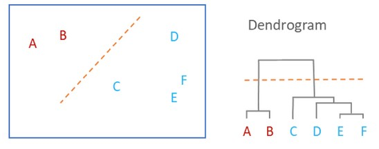

# DM (Datamining 2021/2022)

### Obecné pojmy
- prediktor = vstupní proměná = nezávislá proměná
- target variable = cílová proměná = závislá proměná
- vyvážená datová sada - má stejný počet u každého vzorku (každý druh kosatce měl 50 záznamů)
### Rozdělení algoritmů
- supervised algoritmy - s učitelem
  - vždycky musím znát cílovou proměnou (target)
  - klasifikace/predikce
- unsupervised - bez učitele
  - shlukování

### Kontrolní Otázky
1.  Co je datamining?
  1.  Datamining je proces objevování významných netriviální závislostí vzorů a trendů prozkoumáváním velkých objemů dat pomocí algoritmů pro odhalování pravidel a pomcí matematickáchc a statistických algoritmů
2.  Co se skrývá pod zkratkou CRM?
    1. Customer relationship managment - Pomáhá udržet staré klienty a získat nové. Je to vlastně centrální databáze, kde jsou uložená data o zákaznících.   
3.  Jaké typy úloh DM patří do portfólia problémů CRM?
    1.  Získání nových zákazníků, udržení stávajících, zvýšení prodejů
4.  Jaké úlohy DM řeší obvykle finanční instituce?
    1.  Například pravděpodobnost že člověk půjčující si peníze je splatí. Také při objevování podvodů.
5.  Kde všude se dá DM uplatnit?
6. Je pravdivé tvrzení, že DM odhalí v datech vše podstatné?
   1. Ne, vždy je nejprve nutné si stanovit si cíle. Vždy hledáme závislosti vzhledem k našemu cíli.
7.  Je pravdivé tvrzení, že DM je modelování?
    1.  Nejenom modelování. Podle CRISP DM se proces zkládá z :
        1.  Bussiness understanding
            1.  analitická fáze, kde se snažím porozumět problematice
            2.  Zde definujeme co budeme dělat a plánujeme projekt z manažerského hlediska
            3.  Stanovujeme si co očekáváme od daného projektu
        2.  Data Understanding
            1.  Další analitická fáze, zde se snažím porozumět datům
            2.  Prvotní sběr dat
            3.  Vytipovávám zajímavé podmnožiny
        3.  Data preparation
            1.  Fáze výkonná - už připravuju data (vytváříme tzv modelovací matici)
            2.  Časově nejnáročenjší fáze
        4.  Modeling
            1.  Fáze výkonná
            2.  Vytvářím predikční modely
        5.  Evaluation
            1.  Fáze výkonná
            2.  hodnotíme úroveň s jakou model dosahuje obchodních cílů
        6.  Deployment
            1.  nasazení do praxe
8.  Je pravdivé tvrzení, že DM pracuje pouze s obrovskými datovými množinami?
    1.  Není to pravda, ale na druhou stranu čím více dat tím většinou lépe.
9.  Co je dendrogram a z jakých částí se skládá?
    1.  Dendrogram je diagram ukazující hierarchické vztahy mezi objekty
    2.  Skládá se z takzvaných Clusterů - viz obrázek
    3.  - 
10. Jaké typy klasifikačních stromů znáte? Které jsme už použili v Modeleru?
    1.  CHAID, C5.0, QUEST, a C&R Tree
11. Kolik prediktorů má obvykle klasifikační úloha k dispozici?
    1.  Více než 1, například v úloze Houby je 23 prediktorů (některé z ních jsou zbytečné jako ruská ruleta), u ostatních úloh to bylo méně např kosatce měli pouze 4
12. Kdy se zastaví růst stromu?
    1.  Máme 100% zařazení do kategorií
    2.  Nejsou k dispozici žádné prediktory nebo zádná významné prediktory
    3.  Bylo dostaženo stop kritérií
13. Co je to Boosting?
    1.  Sekvenční vytváření více stromů
    2.  Případy s chybnou klasifikací v předchozím stromu mají vyšší váhu
    3.  Vzniknou rozhodovací lesy ve kterých stromy při rozhodování hlasují
14. Co je Pruning?
    1.  Prořezávání stromů - zobecnění přiliš specifických stromů, z hotového stromu se odstraní málo významné větve(podstromy)
15. K čemu slouží uzel Partition?
    1.  PARTITION (field ops) - rozdělí data na trénovací a testovací
16. Pomocí jakých uzlů můžeme vyhodnotit kvalitu vytvořeného modelu?
    1.  Analysis - Můžeme porovnat více modelů jejich úspěšnost na testovacích a tréningových datech a také shodu mezi sebou
    2.  Matrix(Použili jsme u hub - viděli jsme přesně kolik bylo vyhodnocených správně a špatně)
17. K čemu slouží uzel Feature Selection?
    1.  FETURE SELECTION (models - supervised) - odstraní nepotřebné sloupce
18. Co jsou chyby prvního a druhého druhu?
    1.  Prvního druhu jsou falešně pozitivní chyby
    2.  Druhého druhu jsou falešně negativní chyby
