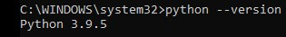

# Analýza nákupního košíku
## Zadání úlohy
- Obchodní řetěžec potřebuje analyzovat nákupní zvyklosti zákazníků, aby bylo možné provádět cílené nabídky určitého typu zboží
- Dva cíle
  - vytvořit akci na prodej konkrétního zboží (nabídnout/nenabídnout alkohol)
  - vytvořit doporučení jaké zboží zákazníkovi ještě nabídnout

## Příprava prostředí
### Krok 1 - Instalace Python
1. Stáhneme python z oficiálních stránek **[python.org](https://python.org)**
2. Nainstalujeme
3. Ověříme instalaci pomocí příkazu "python --version" v příkazové řádce
   

### Krok 2 - Virtuální prostředí
1. Pomocí pipu nainstaluje virtuální prostředí "pip install virtualenv"
2. Pomocí příkazu "virtualenv env" vytvoříme virtuální prostředí
3. Aktivujeme virtuální prostředí pomocí "env\Scripts\activate" (vypnutí pomocí deactivate)
4. pip install jupyter
5. jupyter-notebook
                                                                                               
## Příprava dat
1. Vytvoříme si skript PrepareData.ipynb
2. Pro práci s soubory s příponou budeme potřebovat balík Pyreadstat
   1. Nainstalujeme pomocí příkazu "pip install pyreadstat"
3. Pro apriori - https://www.youtube.com/watch?v=0yaYwDyBxFA
   1. pip install mlxtend

1. Grafy - pip install seaborn
2. pip install pyvis - network grafy

## Na školním počítači 
- vytvoř složku v domácím adresáři C:\Users\jmeno.prijmeni\Semestral
- příkazem "python -m venv env" vytvoř virtuální prostředí
- Aktivuj pomocí C:\Users\jmeno.prijmeni\Semestral\env\Scripts\activate.bat
- vypnutí pomocí deactivate

- pip install jupyter
- pip install pyreadstat
- pip install mlxtend
- pip install seaborn
- pip install pyvis