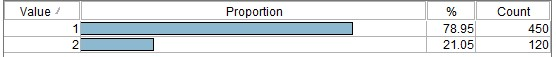
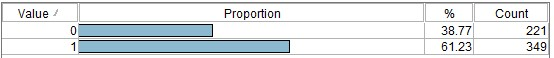
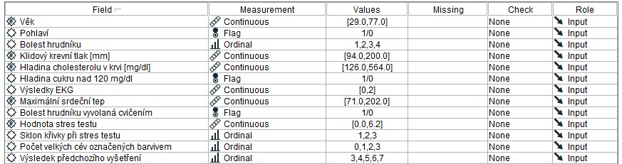
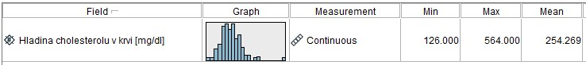
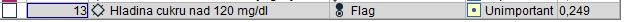
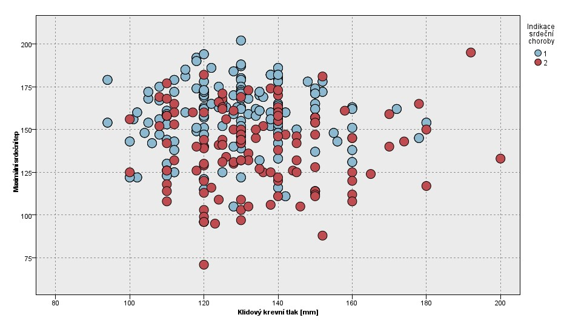
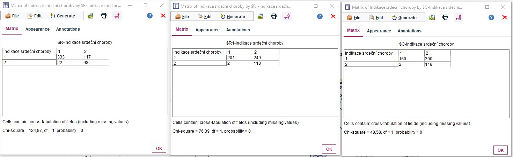
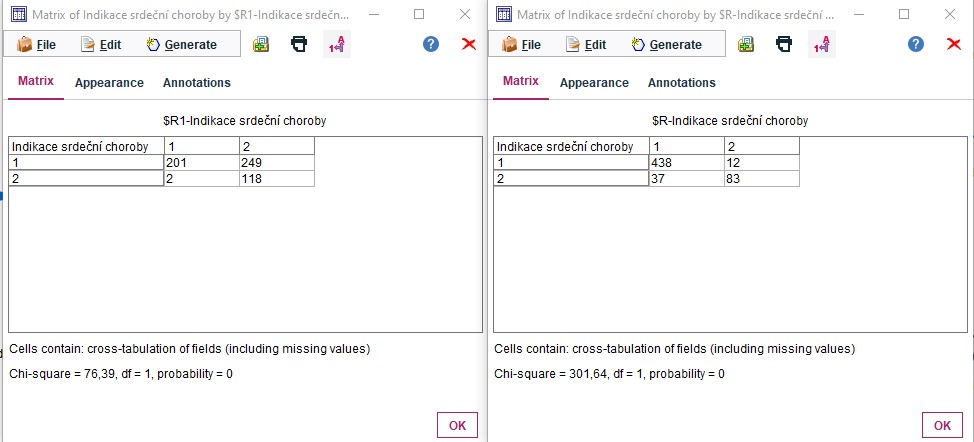

# Choroby srdce
Velkými písmeny jsou názvy bloků
Nemocných je méně
## Postup

### Import
- STATISTICS FILE (source), field delimeters Tab
- TYPE (field ops) - kompletní přetypování

### Porozumění datům
 - DATA AUDIT(output)
 - 

### Příprava dat
- FETURE SELECTION (models - supervised) - odstraní nepotřebné sloupce
- PARTITION (field ops) - rozdělí data na trénovací a testovací
  
### Modelování
 - Použijme CHAID a QUEST a C&R Tree (models - supervised)
 - Na CHAID použijeme MATRIX (Rows - jedovatost, Col - R2 jedovatost (odhad CHAID))
   - řekl o 48 jedovatých že jsou jedlé -> budeme nastavovat penalizaci
     - nastavení bloku (ne diamantu) - záložka COSTS 
     - 
     - z matice záměn vidím že vyhodí 72 jedlých hub z celkové sady
     - 
   - QUEST námn při stejném nastavení pořád nechá 48 jedovatých v jedlých houbách

### Testování

### Otázky

1. Je datová množina vyvážená z hlediska cílové proměnné?
   1. Není 
   2. 
2. Je datová množina vyvážená z hlediska prediktoru Pohlaví?
   1. Je na tom lépe než cílová proměná
   2. 
3. Určete minima a maxima u jednotlivých prediktorů.
   1. 
4. Určete průměrnou Hladinu cholesterolu v krvi u pacientů nad 50 let.
   1. SELECT - vyšší než 50
   2. FILTER - odstraní nepotřebné sloupce
   3. DATA AUDIT
      1. 
5. Která proměnná je z hlediska predikce choroby srdce nevýznamná?
   1. FEATURE SELECTION
   2. Hladina cukru je zbytečná
   3. 
6. Znázorněte graficky závislost Klidového krevního tlaku na Maximálním srdečním tepu, případně jinou podle vás zajímavější charakteristiku.
   1. 
   2. Graf není moc zajímavý
7. Vytvořte datový proud v IBM SPSS Modeleru nebo KNIME, pomocí něhož bude možné indikovat choroby srdce. Pro modelování použijte modelovací uzly, které již znáte. Pokuste se zamezit chybám druhého druhu, kdy nebude indikována choroba, ale ve skutečnosti by indikována být měla.
   1. 
   2. použil jsem zleva Quest, Chaid, C5
      1. Chaid při použítí penalizace dospěl k nejlepším výsledkům a zamezil nejvíce chybám druhého druhu
8. Zjistěte, kolik případů chyby druhého druhu se „přelilo“ při penalizaci klasifikátoru mezi jednotlivými buňkami v matici chyb (matici záměn).
   1. 
9.  Zobrazte v tabulce kompletní záznamy, kde se vybrané dva klasifikátory spletly.
10. Vypočítejte z hodnot v matici záměn pro vybraný model celkovou správnost, celkovou chybu, přesnost a úplnost.
11. Zobrazte a pokuste se vysvětlit grafy zisku (Gain) nebo ROC křivku v KNIME.
