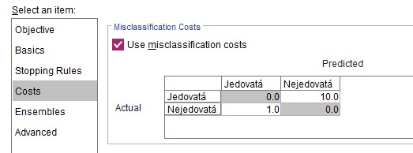
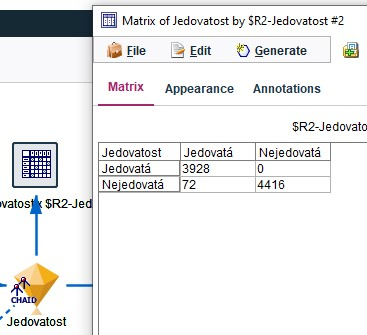

# Houby
Velkými písmeny jsou názvy bloků
## Informace (zadání)
- 8000 záznamů
- target je jedovatost
- nechceme sníst jedovatou houbu tj budeme vyhazovat i jedlé houby
## Postup
### Import
- STATISTICS FILE (source), zaškrtnout zaškrtávátko, u values read labels as data
- TYPE (field ops) - vše je nastaveno OK

### Porozumění datům
 - DATA AUDIT(output)
   - závoj je zbytečný, zápach nám dobře rozdělí
 - zkusili jsme  u kolika hub se otrávím pokud je sním a vezmu jen ty se bezzápachu a použiju ruskou rulet -> 67

### Příprava dat
- FETURE SELECTION (models - supervised) - odstraní nepotřebné sloupce
- PARTITION (field ops) - rozdělí data na trénovací a testovací
  
### Modelování
 - Použijme CHAID a QUEST a C&R Tree (models - supervised)
 - Na CHAID použijeme MATRIX (Rows - jedovatost, Col - R2 jedovatost (odhad CHAID))
   - řekl o 48 jedovatých že jsou jedlé -> budeme nastavovat penalizaci
     - nastavení bloku (ne diamantu) - záložka COSTS 
     - 
     - z matice záměn vidím že vyhodí 72 jedlých hub z celkové sady
     - 
   - QUEST námn při stejném nastavení pořád nechá 48 jedovatých v jedlých houbách

### Testování