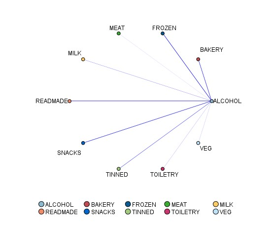

# Analýza nákupního košíku
Velkými písmeny jsou názvy bloků
- na základě dat od zákazníků (kartičky)
- cílené kampaně na zákazníka

## Zadání úlohy
- obchodní řetěžec potřebuje analytovat nákupní zvyklosti zákazníků, aby bylo možné provádět cílené nabídky určitého typu zboží
- Dva cíle
  - vytvořit akci na prodej konkrétního zboží (nabídnout/nenabídnout)
  - vytvořit doporučení jaké zboží zákazníkovi ještě nabídnout
  - jde o úlohy tzv. křížového a následného prodeje které se vyskytájí v prostředích všech společností, které nabází zákazníkům své zboží nebo služby
### Popis úlohy
   - Připrava datové matice
   - Analýza dat - pavučinový diagram
   - Modelování - uzly generující asociační pravidla (apriori a carma)
   - Deployment - vytvořené modely aplikujeme okamžitě u pokladny (pokladny jsou nahrazeny formulářem pro zadání košíku)
### Popis dat
- Shopping items  - transakční data po průchodu zákazníka pokladnou
  - zjednodušení z konkrétního zboží na tzv. produktové skupiny
  - id (identifikátor nákupu), item (produktová skupina)
- Shopping buyes -údaje o zákazníkovi 
  - předpoklad použítí zákaznické karty
  - ID,gender (pohlaví),age (věk),martial(rodiný stav),children (jestli má děti),working (jestli pracuje)
### Transakční vs tabulková data v modeleru
   - Transakční data
     - mají záznam o jednotlivých aktivitách (každá položka jako jeden řádek)
   - Tabulková data (nákupní košíky)
     - jednotlivé položky reprezentované jako jednotlivé příznaky

## Postup
### Příprava dat - nákupní košík
- Import STATISTICS FILE(source) - nezapomenout zaškrtávátko
- TYPE (field ops) - nastavím target jako drug
- DISTRIBUTION (graphs) - četnosti skupin,proporcional scale
- 
- SET TO FLAG (field ops) - Všechny flagy, agreguji podle ID (pro každé ID jeden řádek = agregace)
  - vytvoříme tzv nákupní koše
- FILTER (field ops) - přejmenuji data (odeberu ITEM_)
- DISTRIBUTION (graphs) - četnosti v nákupním košíku (all flags true value)
- 
- Import STATISTICS FILE (source) - přidávám druhou tabulku buyers (read labels as data)
- MERGE (record ops) - spojíme data (spojujeme podle ID)
- TYPE (field ops)
- STATISTIC EXPORT (export) - můžu exportovat do NakupyDM2021 (můžu do dalšího použit Nákupy které nám byly poskytnuty)

### Modelování nákupu
- import STATISTIC FILE (souce) - nákupy
- TYPE (field ops)
  - true false hodnoty jako flag a jejich role jako both 
  - Zbytek proměných nepoužijeme dáme jako none
#### Analýza dat
   - hledám co se dobře nakupuje s alkohlem
   - WEB (graph) - směrový
     - Directed web (alcohol)
     - From field od pečiva až po zeleninu
     - V procentech
     - Chceme jenom true
     - 
#### Modelování
- APRIORI (modeling - association)
  - confidence 70%
  - show all
  - Apriori diamant (Vysvětlení sloupců na pravidlu číslo 37 viz obrázek)
    - CONSEQUENT - závěr - alcohol
    - ANTECEDENT - předpoklady Mražené, pečivo , čtivo
    - ID - číslo pravidla
    - INSTANCES ve 109 nákupních košících se objevili předpoklady (pečivo,mražené a čtivo)
    - SUPPORT - procentuální z celkových košíků (786 nákupních košíků)
    - CONFIDENCE - V kolika připadech košíků s předpoklady mělo Závěr = Ze 109 zkoumaných košíků jich 75 procent obsahoval alkohol
    - RULE SUPPORT - pokrytí, v kolika procentech bylo splněny předpoklady i závěr ze všech košíků (10% z 786 košíků)
    - LIFT - podíl CONFIDENCE/nepodmíněná pravděpodobnost (četnost alkoholu v nákupním košíku - 39%)  
    - DEPLOYABILITY - Lidi kteří splnili podmínky ale alkohol si nekoupili (3% z 786 můžeme přesvědčit)
  - 
- Vygenerujeme si nový diamant - generate -> ruleset
  - 
  - už můžeme použít protože má jenom alkohol
  - Nemusím řešit protože nemám testovací a třénovací data
    - napojím na type
    - přejmenuji $A-10 fields na $A-ALCOHOL
    - přejmenuji $AC-10 fields na $AC-ALCOHOL
    - ANALYZE - field name format
- Druhá část zadání (co na základě košíku nabídnu)
  - WEB - co s čím se kupuje nejvíc
    -  
 -  CARMA (modeling - association)
    -  nabídne top 3 pro daného zákazníka
    -  models (nastavím jak kvalitní model chci) -> 
       -  confidence nastavím na 50%
       -  Support 10%
    -  nové řádky v table po diamantu
       -  Co by doporučil BAKERY na 60, plechovky na 56 a alkohol na 55
       -  

### Testování - Pokladna
- nakopírují userinput
- vyrobím novou proměnou
  - DERIVE - > nabídka  
    - true when - " not(ALCOHOL)  and '$A-10 fields'" 
    - abych nabízel jenom pokud alkohol ještě nemá a má v košíku věci které implikují alkohol
- můžu si nakonfigurujovat nákup
- Připojím si na CARMU ( pravidla vše)
  - připojím REPORT (output) 
  - do hranaých závorek pišu sloupec
