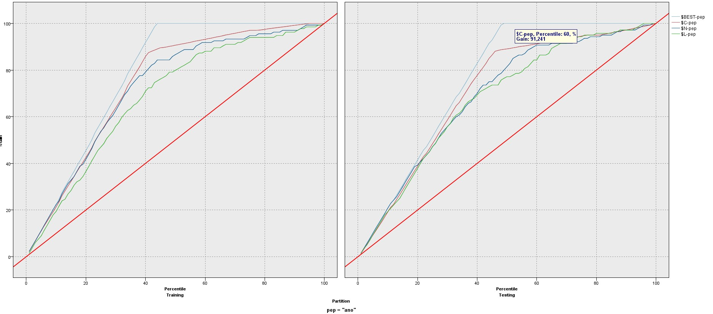

# Zacileni marketingové kampaně
Velkými písmeny jsou názvy bloků
## Postup
### Příprava dat
- Import VAR FILE(source) 
- TYPE - specify data u PEP - True = ANO, False = Ne (bylo obráceně)
- Pomoci BALANCE (generate v distribuci) - vygeneruje nový node na vývážení
- DISCTRIBUCE - počet dětí na pep (normalizováno)
- PLOT - přijem na děti, obarveno PeP chci jitter aby se rozložilo a graf byl čitelnější
- PARTITION - rozdělení na test a uč data
- DERIVE - prachynaděcko = prachy/děcko pokud dítě > 0 jinak prachy
- chci se podívat na prachynadecko jenom pro 1-3 děti
  - SELECT
  - V distribuci oznacim deti 1,2,3 a dám generate select node for table
- Modelování - C.5, Neuronka, a logistická regrese (LOGISTIC)
- EVALUACE (graphs) - ještě zaškrtnu include best line
- pokud použiju 60% lidí dostanu 90% zájemců
- 
### Nasazení do praxe
- DATABASE (sources)
  - připojení přes aplikaci ODBC -> přidat -> SQL server -> změnit výchozí databázi na modeler
  - v modeleru -> datasource -> vyberu zacileni -> vypnim přihlašovací údaje -> ok -> vyberu tabulku